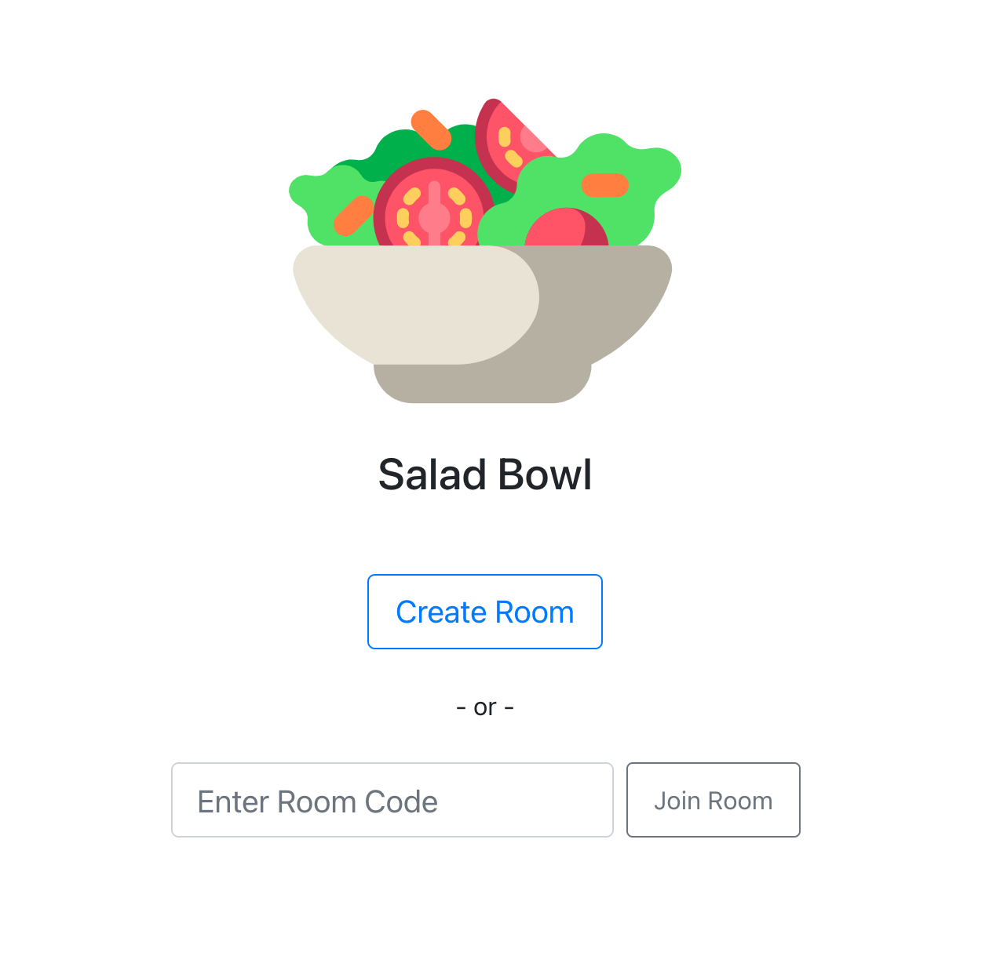

# SaladBowl

## **Work in Progress**

Online multiplayer game made using websockets and React. 
Submit words, then players take turns giving clues to try to get their team to guess the words.



Backend code: https://github.com/kev-kev/salad-bowl-backend

## 1. Clone repositories

In a terminal window, run the following commands:

```
clone frontend

$ git clone git@github.com:kev-kev/salad-bowl-frontend.git


clone backend

$ git clone git@github.com:kev-kev/salad-bowl-backend.git
```

## 2. Install dependencies (optionally you can install [yarn](https://yarnpkg.com/)):

Navigate to the cloned frontend repo.

Run:

`npm install`

or if you chose yarn, just run `yarn`

Then, cd into the backend repo and run:

`bundle install`

## 3. Run the app:

In terminal, cd to the frontend folder and run:

`npm start`

Then, in the backend folder, run: 

`node app.js`

This will start the React app and backend server on ports 3000 and 4000 respectively.
